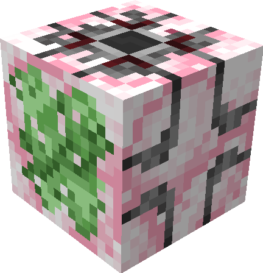

# Tatervator

[>> Downloads <<](https://github.com/LemmaEOF/flashfest-potato/releases)

*Wheeee!!*

**This mod is open source and under a permissive license.** As such, it can be included in any modpack on any platform without prior permission. We appreciate hearing about people using our mods, but you do not need to ask to use them. See the [LICENSE file](LICENSE) for more details.

Tatervator is a mod for the 24w14potato april fools snapshot. It was created in a few hours based on new snapshot features for FlashFest Potato.

Tatervator adds multiblock elevators based on the floatater. They can be crafted with a floatater, floatatoes, and poisonous potatoes.

Any blocks attached to the sticky side of the elevator will be counted as its surface. Give the tatervator an odd-numbered redstone power to ascend, and
give it an even-numbered (non-zero) redstone power to descend.

Due to how the sub-grid system is implemented on Mojang's side, there can be some strange behaviors. Be sure to keep an 
air block in the direction the sticky side of the tatervator is facing. I could theoretically fix this, but then that wouldn't be within the time space of the FlashFest.

I hope you enjoy!~